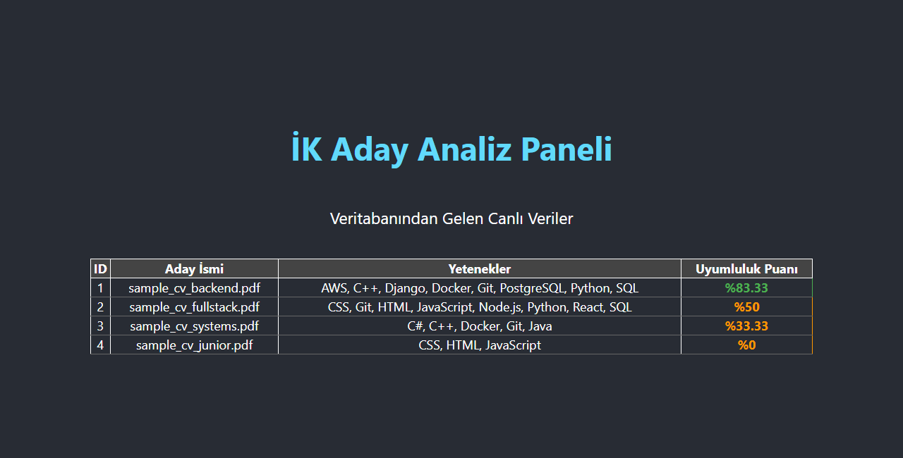
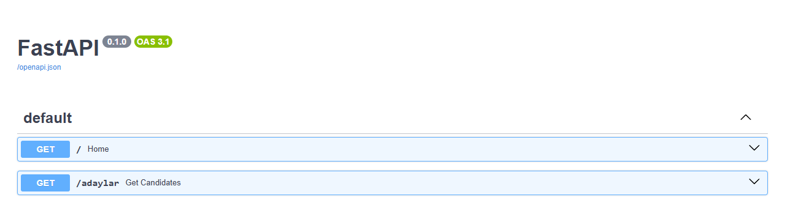

# CV Analyzer: Full-Stack Candidate Tracking System 🚀

This project is a full-stack application that analyzes CVs in PDF format, extracts skills, and calculates compatibility scores with a job description.

## 📸 Screenshots

The dashboard (in Turkish) reads candidates from the API, and the score is the share of the job description's required skills that were found in each CV. The screenshots use sample data.

**Candidate dashboard (React)**



**Backend API (FastAPI, auto-generated docs)**



## 🛠 Technologies Used

-   **Backend:** [FastAPI](https://fastapi.tiangolo.com/) (Python), SQLite, Regex-based Parser.
-   **Frontend:** [React](https://reactjs.org/) (JavaScript/CSS), Fetch API.
-   **Libraries:** PyPDF2 (PDF parsing), sqlite3 (Database).

## 📂 Project Structure

```text
CV_Analyzer_Project/
├── cv-frontend/          # React Dashboard
├── parser.py             # CV Analysis Engine (Regex & PDF)
├── main.py               # FastAPI Backend API
├── sample_cv.pdf         # Fictional CV used by the parser by default
├── .gitignore            # Git exclusion file
└── README.md             # Documentation
```

## 🚀 Installation and Usage

### 1. Backend Setup

First, install the required libraries:
```bash
pip install fastapi uvicorn PyPDF2
```

Then, run the parser to analyze CVs and populate the database:
```bash
python parser.py
```

By default it analyzes the fictional `sample_cv.pdf` included in the repository. To analyze your own CV, put the PDF in the project folder and change the file name in `parser.py`.

Finally, start the API:
```bash
python -m uvicorn main:app --reload
```
The API will be running at: `http://127.0.0.1:8000`

### 2. Frontend Setup

Navigate to the `cv-frontend` folder and install dependencies:
```bash
cd cv-frontend
npm install
```

Start the application:
```bash
npm start
```
The interface will open at: `http://localhost:3000`

## 📊 Features
- **Smart Skill Detection:** Uses Regex to accurately detect technical skills like "C++", "C#", "Python".
- **Compatibility Scoring:** Compares candidate skills with job description criteria.
- **Live Dashboard:** Displays data from the backend in a modern table interface.

---
Developed by: **Yusuf Koyuncu**

